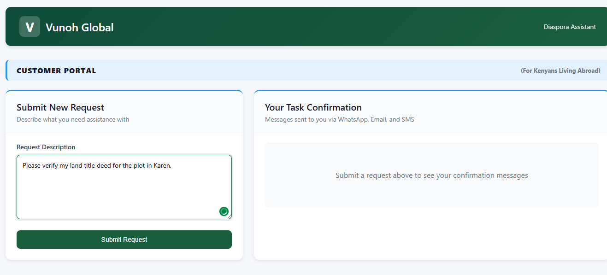
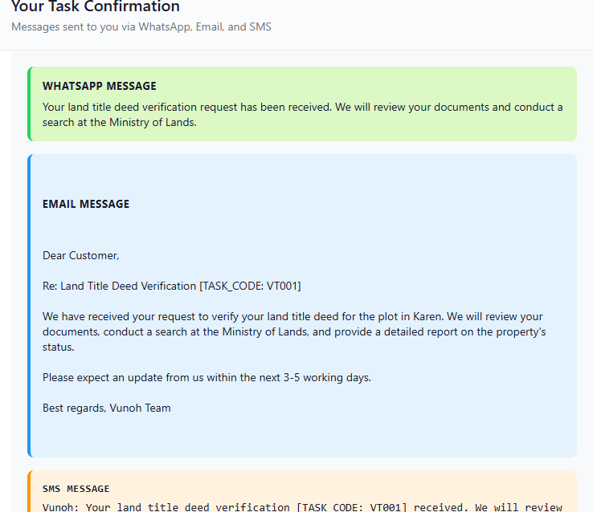
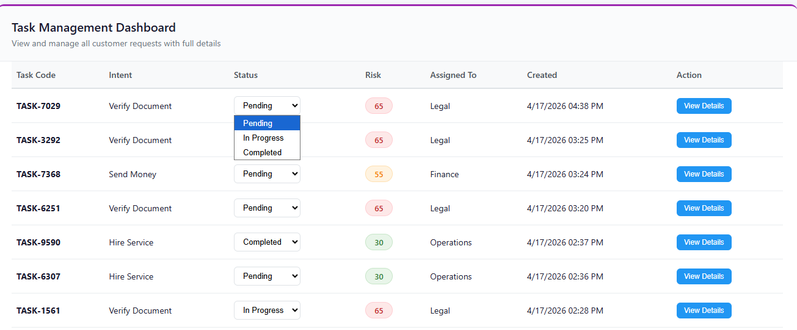
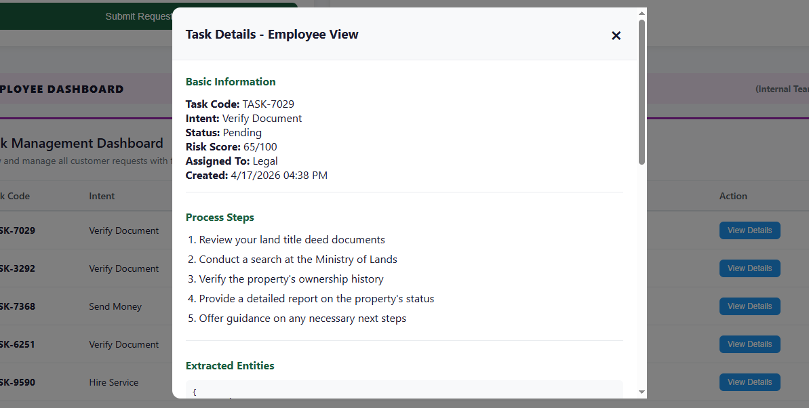

# Vunoh Global - Diaspora Assistant

AI-powered web application helping Kenyans living abroad manage tasks back home including money transfers, service hiring, and document verification.

## Screenshots

### Customer Portal - Submit Request


*Customers describe their request in natural language*

### Task Confirmation Messages


*Customers receive three message formats: WhatsApp, Email, and SMS style confirmations*

### Employee Dashboard


*Internal team views all tasks with risk scores and status*

### Full Task Details (Employee View)


*Employees can view complete task details including process steps and extracted entities*


## Tech Stack

- Backend: Node.js, Express
- Database: PostgreSQL
- Frontend: Vanilla HTML, CSS, JavaScript
- AI: Groq API (Llama 3.3 70B)

## Project Structure

```text
AI-powered-web-app/
├── backend/
│   ├── server.js
│   ├── db.js
│   ├── .env
│   ├── package.json
│   ├── routes/
│   │   └── tasks.js
│   └── services/
│       ├── aiService.js
│       └── riskScoring.js
├── frontend/
│   ├── index.html
│   ├── style.css
│   └── script.js
├── database/
│   ├── schema.sql
│   └── full_dump.sql
├── images/
│   ├── dashboard.png
│   ├── messages.png
│   ├── task-steps.png
│   └── task-creation.png
├── .gitignore
└── README.md
```

## Setup Instructions

### Prerequisites
- Node.js installed
- PostgreSQL installed and running
- Groq API key from console.groq.com (free)

### Database Setup
```bash
psql -U postgres
CREATE DATABASE diaspora_assistant;
\c diaspora_assistant
\i database/schema.sql
```

### Backend Setup
```bash
cd backend
npm install
cp .env.example .env
# Add your database password and Groq API key to .env
node server.js
```

### Frontend Setup
```bash
cd frontend
python -m http.server 8000
```

### Access Application
Open browser to `http://localhost:8000`

## Features

- AI intent recognition from natural language
- Risk scoring based on amount, urgency, and document type
- Task creation and tracking
- Three message formats: WhatsApp, Email, SMS
- Auto-assignment to Finance, Operations, or Legal teams
- Dashboard with status updates
- Customer view shows only messages
- Employee view shows full task details including process steps

## API Endpoints

| Method | Endpoint | Description |
|--------|----------|-------------|
| POST | /api/tasks | Create new task |
| GET | /api/tasks | Get all tasks |
| GET | /api/tasks/full/:code | Get full task details (steps + messages) |
| PATCH | /api/tasks/:code/status | Update task status |

## Risk Scoring Logic

The system calculates a risk score from 0-100 based on:

| Factor | Condition | Points Added |
|--------|-----------|--------------|
| Large Amount | > 100,000 KES | +30 |
| Medium Amount | 50,000 - 100,000 KES | +20 |
| Small Amount | 10,000 - 50,000 KES | +10 |
| High Urgency | "urgent", "asap", "quickly" | +25 |
| Medium Urgency | "medium" urgency | +10 |
| Unverified Recipient | Recipient not verified | +30 |
| Land Title | Document type is land title | +40 |
| ID Card | Document type is ID card | +15 |
| Returning Customer | Customer with clean history | -20 |

Risk score is capped between 0-100 and color-coded in the dashboard:
- Green (0-30): Low risk
- Orange (31-60): Medium risk
- Red (61-100): High risk

## Message Formats

### WhatsApp Style
Conversational, no emojis, under 200 characters. Example:  
"Your money transfer request of KES 50,000 to your mother has been received. We will process it shortly. Task: TASK-1234"

### Email Style
Formal email starting with "Dear Customer", includes task code and full details. Example:

"Dear Customer,

Your money transfer request has been received.

Task Code: TASK-1234  
Amount: KES 50,000  
Recipient: Your Mother  
Risk Score: 55/100  

We will verify your identity and process the transfer.

Best regards,  
Vunoh Global"

### SMS Style
Short text under 160 characters. Example:  
"Vunoh: Your transfer of KES 50,000 to your mother [TASK-1234] received. Processing."

## Decisions I Made and Why

### AI Tools Used
- Groq API (Llama 3.3 70B) - Chose for free tier availability and faster response times
- GitHub Copilot - Used for boilerplate code generation and debugging

### System Prompt Design
- Specified exact intent categories (send_money, hire_service, verify_document) for consistent outputs
- Included entity extraction for amount, recipient, location, document_type, urgency
- Added special case detection for "buy apartment" → land title verification
- Requested JSON format with temperature 0.3 for reliable parsing
- Explicitly instructed that messages must be addressed TO THE CUSTOMER, not internal teams

### One Override of AI Suggestion
AI suggested OpenAI GPT-4 with paid credits. I overrode this and switched to Groq's free Llama 3.3 API because the project has zero budget and Groq provides sufficient quality for intent extraction and message generation.

### One Thing That Did Not Work
Supabase cloud database gave persistent DNS resolution errors (ENOTFOUND). I resolved this by switching to local PostgreSQL, which eliminated network dependencies and provided faster, more reliable connections for development.

## User Interface Sections

### Customer Portal (Top Section)
- Submit new requests via text area
- View confirmation messages only (WhatsApp, Email, SMS styles)
- Task code reference for tracking

### Employee Dashboard (Bottom Section)
- Table view of all tasks with status, risk score, assignment
- Update task status (Pending, In Progress, Completed)
- View full task details modal showing process steps, extracted entities, and all messages

## Sample Tasks Included

The database includes 5 sample tasks:

| Task Code | Intent | Status | Risk Score | Assigned To |
|-----------|--------|--------|------------|-------------|
| TASK-001 | Send Money | Completed | 85 | Finance |
| TASK-002 | Hire Service | In Progress | 30 | Operations |
| TASK-003 | Verify Document | Pending | 85 | Legal |
| TASK-004 | Send Money | Completed | 20 | Finance |
| TASK-005 | Hire Service | Pending | 30 | Operations |

Each sample task includes complete steps, WhatsApp/Email/SMS messages, and extracted entities.

